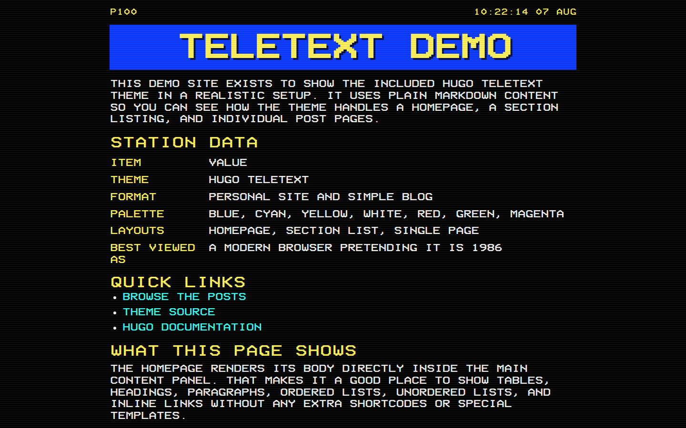

# Hugo teletext demo site

Demo site https://mrchazaaa.github.io/hugo-teletext-demo/.

<!-- screenshot:start -->

<!-- screenshot:end -->

# Running

Use the local dev config when serving the site so `baseURL` points at localhost:

```bash
hugo server --config hugo.toml,hugo.dev.toml
```

Then open `http://localhost:1313/hugo-teletext-demo/`.
